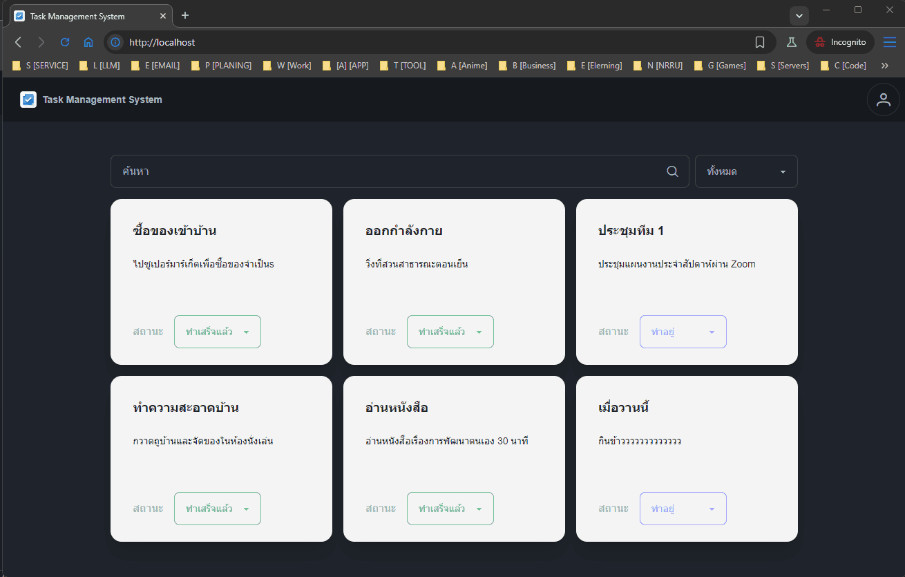

<div align="center">

# Task Management System



</div>

# เริ่มต้น

```bash
git clone https://github.com/watchakorn-18k/task-management-system-vue-fiber
cd task-management-system-vue-fiber

```

# รัน mongodb กับ redis
```bash
# docker
docker-compose -f backend/docker-database.yml up -d

# podman
podman-compose -f backend/docker-database.yml up -d
```

# รัน backend
```bash
# docker
docker-compose -f backend/docker-compose.yml up -d

# podman
podman-compose -f backend/docker-compose.yml up -d
```

# รัน frontend
```bash
# docker
docker-compose -f frontend/docker-compose.yml up -d

# podman
podman-compose -f frontend/docker-compose.yml up -d
```

# ติดตั้ง backend และทดสอบรัน
```bash
cd backend
go mod tidy
go run .
```

# ติดตั้ง frontend และทดสอบรัน
```bash
cd frontend
# npm
npm install
npm run dev

# bun
bun install
bun run dev
```


